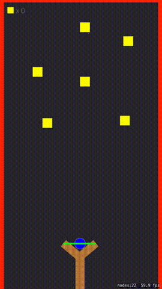

#Slingshot
Slingshot is a simple demo application using Apple's SpriteKit framework. Feel free to download and create your own awesome slingshot game.

##Slingshot Touch Controller
Touch and drag to move the ball around. The ball is clamped and unable to move beyond a set range. Each side of the sling uses a SKShapeNode using a CGPath to draw a line from each side of the slingshot to the ball.

##Slingshot Physics

When the ball is released an impulse is applied to the ball based on its position and its starting position. When the ball collides with a yellow box it doesn't effect the balls physics and the yellow coin runs a series of SKActions. When the ball goes off screen it gets set back to its starting position if yellow boxes are left. If no yellow boxes are left it is game over and tapping the screen will relaunch the scene.

##License

Copyright (c) 2016 SpriteKit Alliance

Permission is hereby granted, free of charge, to any person obtaining a copy
of this software and associated documentation files (the "Software"), to
deal in the Software without restriction, including without limitation the
rights to use, copy, modify, merge, publish, distribute, sublicense, and/or
sell copies of the Software, and to permit persons to whom the Software is
furnished to do so, subject to the following conditions:

The above copyright notice and this permission notice shall be included in
all copies or substantial portions of the Software.

THE SOFTWARE IS PROVIDED "AS IS", WITHOUT WARRANTY OF ANY KIND, EXPRESS OR
IMPLIED, INCLUDING BUT NOT LIMITED TO THE WARRANTIES OF MERCHANTABILITY,
FITNESS FOR A PARTICULAR PURPOSE AND NONINFRINGEMENT. IN NO EVENT SHALL THE
AUTHORS OR COPYRIGHT HOLDERS BE LIABLE FOR ANY CLAIM, DAMAGES OR OTHER
LIABILITY, WHETHER IN AN ACTION OF CONTRACT, TORT OR OTHERWISE, ARISING
FROM, OUT OF OR IN CONNECTION WITH THE SOFTWARE OR THE USE OR OTHER DEALINGS
IN THE SOFTWARE.
